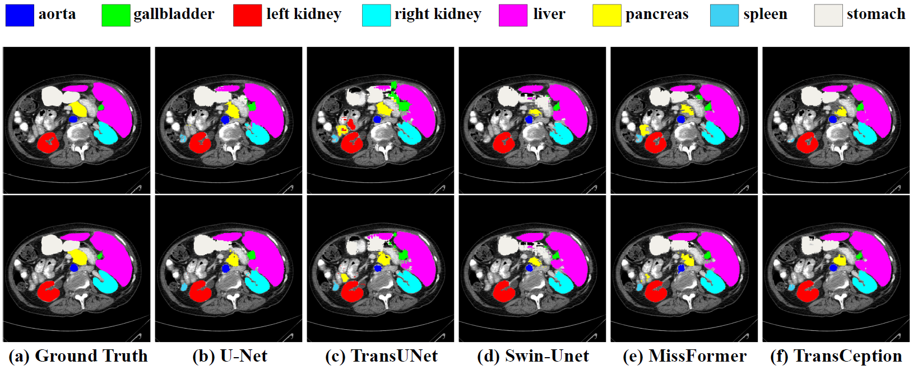

# TransCeption: Hierarchical and Inception-like Transformer Design for Medical Image Segmentation

TransCeption is a U-shaped hierarchical architecture which aggregates the inception-like structure in the encoder based on the pure transformer network.

 In this approach,  

- We employ ResInception Patch Merging (RIPM) and Multi-branch Transformer Block (MB transformer) at each stage of the encoder to extract the multi-scale features of both global contextual information and local finer details.

- Intra-stage Feature Fusion Module (IFF) is introduced to emphasize the interactions across the channel dimension of concatenated feature maps with the crucial positional information properly retained.

- We redesign Dual Transformer Bridge based on the Enhanced Transformer Context Bridge ([MISSFormer](https://github.com/ZhifangDeng/MISSFormer)) to further model inter-stage correlations of hierarchical multi-scale features.

## Updates

## Requirements

This code is implemented in python 3.6.3 using PyTorch library 1.8.0 and tested in ubuntu OS. We use the libraries of these versions:

- Python 3.6

- Torch 1.8.0

- torchvision 0.2.2

- numpy 1.19.5

To set up the correct environment, we recommend running the following code to install the requirements.

```python
pip install -r requirements.txt
```

## Dataset preparation

- Synapse Dataset: please go to "./datasets/README.md" for the details about preparing preprocessed Synapse dataset or download the Synapse Dataset from [here](https://drive.google.com/uc?export=download&id=18I9JHH_i0uuEDg-N6d7bfMdf7Ut6bhBi).

- ISIC 2018: please download the ISIC 2018 train dataset from [ISIC Challenge](https://challenge.isic-archive.com/data/).

## Train

Run the following code to train TransCeption on the Synapse Dataset:

```python
--dataset Synapse --base_lr 0.05 --max_epochs 500 --eval_interval 20 --model_name TransCeption --batch_size 16 --root_path <your path to ./Synapse/train_npz> --output_dir <your output path>
```

## Test

Run the following code to test the trained TransCeption on the Synapse Dataset:

```python
python test.py --dataset Synapse --base_lr 0.05 --model_name TransCeption --output_dir <your output path> --br_config 2 --weight_pth <your path to .pth file>
```

## Quick Overview


## Results

### Evaluation metrics

| <h3 align="left">**Methods** </h3> | <p>DSC</p> | <p>HD</p> | <p>Aorta</p> | <p>Gallbladder</p> | <p>Kidney(L)</p> | <p>Kidney(R)</p> | <p>Liver</p> | <p>Pancreas</p> | <p>Spleen</p> | <p>Stomach</p> |
| ---------------------------------- |:----------:|:---------:|:------------:|:------------------:|:----------------:|:----------------:|:------------:|:---------------:|:-------------:|:--------------:|
| DARR                               | 69.77      | -         | 74.74        | 53.77              | 72.31            | 73.24            | 94.08        | 54.18           | 89.90         | 45.96          |
| R50 U-Net                          | 74.68      | 36.87     | 87.74        | 63.66              | 80.60            | 78.19            | 93.74        | 56.90           | 85.87         | 74.16          |
| U-Net                              | 76.85      | 39.70     | 89.07        | 69.72              | 77.77            | 68.60            | 93.43        | 53.98           | 86.67         | 75.58          |
| R50 Att-UNet                       | 75.57      | 36.97     | 55.92        | 63.91              | 79.20            | 72.71            | 93.56        | 49.37           | 87.19         | 74.95          |
| Att-UNet                           | 77.77      | 36.02     | **89.55**    | 68.88              | 77.98            | 71.11            | 93.57        | 58.04           | 87.30         | 75.75          |
| R50 ViT                            | 71.29      | 32.87     | 73.73        | 55.13              | 75.80            | 72.20            | 91.51        | 45.99           | 81.99         | 73.95          |
| TransUnet                          | 77.48      | 31.69     | 87.23        | 63.13              | 81.87            | 77.02            | 94.08        | 55.86           | 85.08         | 75.62          |
| SwinUnet                           | 79.13      | 21.55     | 85.47        | 66.53              | 83.28            | 79.61            | 94.29        | 56.58           | 90.66         | 76.60          |
| TransDeepLab                       | 80.16      | 21.25     | 86.04        | 69.16              | 84.08            | 79.88            | 93.53        | 61.19           | 89.00         | 78.40          |
| HiFormer                           | 80.39      | **14.70** | 86.21        | 65.69              | 85.23            | 79.77            | 94.61        | 59.52           | 90.99         | **81.08**      |
| MISSFormer                         | 81.96      | 18.20     | 86.99        | 68.65              | 85.21            | **82.00**        | 94.41        | **65.67**       | 91.92         | 80.81          |
| TransCeption                       | **82.24**  | 20.89     | 87.60        | **71.82**          | **86.23**        | 80.29            | **95.01**    | 65.27           | **91.68**     | 80.02          |

### Visualization on Synapse

 

Qualitative result of different models on Synapse dataset. From (a) to (f) are Ground Truth, U-Net, TransUNet, Swin U-Net, MISSFormer, and our TransCeption.

## Visualization on ISIC 2018


Visual comparisons of EffFormer baseline and our TransCeption model on the ISIC 2018 Skin Lesion Dataset. Ground truth boundaries are shown in green, and predicted boundaries are shown in blue. 

## Reference

We thank the authors for the great work of [MPViT](https://github.com/youngwanLEE/MPViT), [Swin-Unet](https://github.com/HuCaoFighting/Swin-Unet) ,and [MISSFormer](https://github.com/ZhifangDeng/MISSFormer).